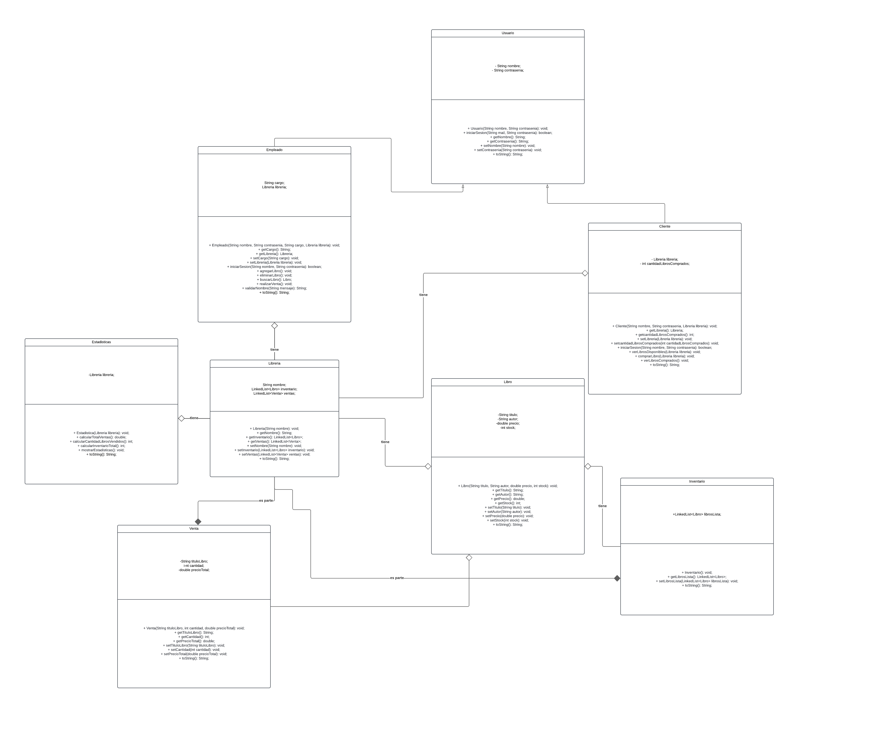

<!DOCTYPE html>
<html lang="en">
<head>
    <meta charset="UTF-8">
    <meta name="viewport" content="width=device-width, initial-scale=1.0">
    
</head>
<body>
    <h1>Parcial 2 Ejercicio 2</h1>
   2)Implementa una funcionalidad para registrar las ventas de libros en una librería y calcular estadísticas de ventas diarias, incluyendo el total de ventas, el género más vendido y el autor más popular. Define una estructura de clases que permita la gestión de ventas y reporte de estadísticas.
Define al menos 3 métodos clave que los objetos se envían entre sí para calcular el total de ventas y determinar el género y autor más vendidos (por ejemplo, registrarVenta() en Librería, calcularTotalVentas() en Estadísticas).

  
    
    
    
</body>
</html>
